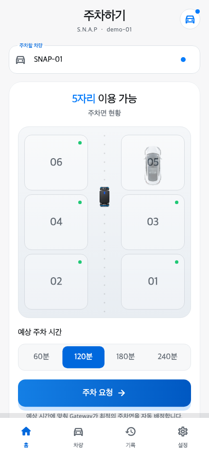
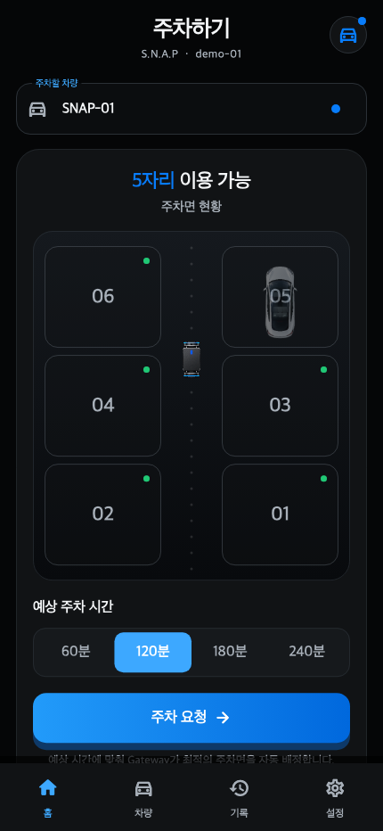
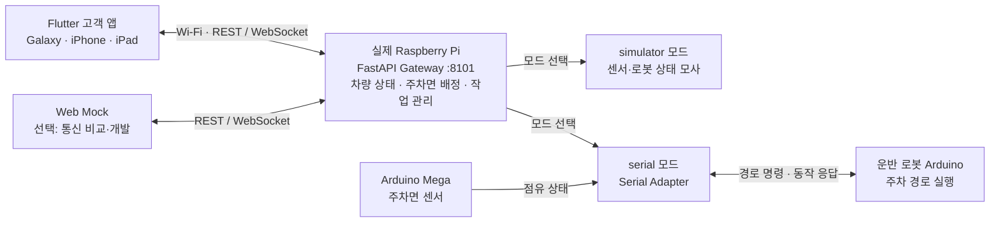

# S.N.A.P

S.N.A.P은 **모바일 앱에서 예상 주차시간을 선택하고 주차·출차를 요청하는 스마트 발렛 주차 시스템**이다. Raspberry Pi가 주차면을 배정하고, 센서와 운반 로봇의 상태를 앱에 전달한다. 모형 주차장을 이용해 사용자 요청부터 장비 동작까지 연결하는 것을 목표로 한다.

이 저장소는 Android·iOS 공통 **Flutter 고객 앱**, **Raspberry Pi Gateway**, 통신 비교·개발용 **Web Mock**을 포함한다. 기본 개발·시연 환경은 실제 Galaxy 또는 iPhone·iPad와 실제 Raspberry Pi다.

<p>
  
  
</p>

현재 Flutter 홈 화면을 고정 데모 데이터로 렌더링한 미리보기다. 웹·모바일의 주차면 번호는 위에서부터 **`6 5 / 4 3 / 2 1`** 순서로 표시한다.

앱 설치부터 시작하는 팀원은 [Windows 10·11 팀원용 Galaxy·iPhone 확인 매뉴얼](docs/manual/windows-mobile-app-device-check.md)을 따른다. Flutter의 역할과 Android·iOS의 관계는 [모바일 기술 설명 자료](docs/mobile-flutter-beginner-guide.md)에 정리돼 있다.

## 개발 목표와 요구사항

핵심 목표는 사용자의 주차 조작을 간소화하고, 예상 주차시간에 따라 공간을 배정하며, 차량과 로봇의 진행 상태를 휴대폰에서 확인하게 하는 것이다. 아래 기능 범위는 [요구사항·구현 계획 및 추적성 기록](docs/suds/260829-snap-web-requirements-traceability-plan.md)의 고객·차량·시간 배정 요구사항을 모바일에 적용한 것이다. 이 기록은 2026-08-29의 설계·구현 기준선이며, 현재 구현 및 검증 상태는 이 README와 각 구성요소 문서를 함께 확인한다.

| 요구사항 | 모바일 앱과 Gateway의 역할 |
|---|---|
| 차량번호 등록 및 복수 차량 관리 | 앱에서 차량을 등록·선택하고, Gateway가 고객 식별자별 차량 상태를 관리한다. |
| 예상 주차시간 선택 | 앱에서 `1시간 / 2시간 / 3시간 / 4시간 이상`을 선택해 전달한다. |
| 시간 기반 주차면 배정 | Raspberry Pi가 1~2시간은 가까운 자리, 3시간은 먼 자리, 4시간 이상은 가장 먼 빈자리를 우선 배정한다. |
| 주차장·차량 상태 확인 | 1~6번 주차면, 배정 위치, 차량별 상태와 로봇 진행 상태를 표시한다. |
| 주차·원터치 출차 요청 | 차량 상태에 맞는 요청을 보내고 처리 결과를 반영한다. 입·출차 전체 흐름은 Simulator에서 확인한다. |
| 단일 로봇 작업 관리 | 로봇은 한 번에 한 작업을 처리한다. 주차된 차량은 상태를 유지하며, 로봇 작업 완료 후 다른 차량을 입차시킬 수 있다. |
| 사용자에게 필요한 정보 제공 | 통로를 따르는 이동 경로와 만차 안내를 제공하고, 배정 기준 선택·배터리·리프트 세부 조작은 고객 화면에서 제외한다. |

주차면 선택과 로봇 명령 결정은 Gateway의 책임이다. 앱에 표시되는 경로·진행률은 수신한 작업 상태를 시각화한 것으로, 실제 위치 센서에 의한 정밀 측위를 보장하지 않는다.

## 기대 효과

| 기대 효과 | 실현 방법과 확인할 지표 |
|---|---|
| 주차·출차 이용 편의 향상 | 차량 등록, 시간 선택, 주차 요청, 차량 호출을 하나의 앱에 모은다. 조작 단계 수와 요청 완료 시간을 확인한다. |
| 주차면 운영 효율 개선 | 단시간 차량을 가까운 주차면에 우선 배정한다. 배정 성공률과 주차면 이용 패턴을 비교한다. |
| 로봇 이동거리·에너지 소비 감소 | 장시간 차량을 먼 쪽에 배치하는 정책을 적용한다. 동일 입·출차 시나리오의 이동거리와 소비 전력을 실장비에서 측정한다. |
| 진행 상태의 가시성 향상 | 주차 위치, 진행 단계, 연결 상태를 실시간으로 표시한다. 상태 반영 지연과 오류 표시의 정확성을 확인한다. |
| 양 플랫폼 개발·유지보수 부담 감소 | Flutter로 Android·iOS 화면과 공통 로직을 공유한다. 플랫폼별 빌드·권한·실기기 검증은 각각 수행한다. |

위 항목은 개발 목표에 따른 기대 효과다. 실제 차량 운용에서의 시간·전력 절감 수치나 상용 주차장의 운영 성능은 아직 검증하지 않았다.

## 모바일 화면과 사용 흐름

앱은 **홈·차량·기록·설정** 4개 탭을 제공하며 Light/Dark 테마와 휴대폰·태블릿 레이아웃을 지원한다. 기록 탭은 현재 차량 상태와 최근 상태 변경 시각을 보여주며, 영구 보관되는 주차 이력 서비스는 아니다.

1. Gateway에 연결해 주차장 현황을 불러온다.
2. 차량번호를 등록하거나 기존 차량을 선택한다.
3. 예상 주차시간을 선택하고 주차를 요청한다.
4. 배정 주차면과 로봇 진행 상태를 확인한다.
5. 주차 완료 후 차량 상태를 확인하고 출차를 요청한다.

웹과 모바일에서 공통으로 사용하는 주차면 배치는 다음과 같다. 각 번호에 연결된 점유 상태·배정 강조·이동 경로를 같은 위치에 표시한다. Gateway의 주차면 ID와 Arduino 명령 번호는 그대로 유지한다.

```text
화면 위쪽
  6   5
  4   3
  2   1
화면 아래쪽
```

기존 [모바일 디자인 스토리보드](mobile/assets/storyboard/tesla-theme)는 초기 디자인 참고 자료이며, 최신 번호 배치는 이 README의 앱 미리보기를 기준으로 한다. 미리보기는 [렌더링 도구](mobile/tool/readme_preview_test.dart)로 재생성할 수 있다.

## 시스템 구성



Flutter는 화면 구성, 입력, 테마, 상태 갱신과 앱 생명주기를 담당한다. Dart 네트워크 코드가 REST로 요청·조회하고 WebSocket으로 실시간 현황을 받는다. 연결이 끊기면 재연결을 시도하며, 재연결 전과 앱이 다시 전면으로 돌아올 때 최신 상태를 조회한다.

앱은 Wi-Fi로 Pi에 직접 연결한다. PC는 앱 빌드·설치에 사용되며, 설치된 앱을 실행할 때 통신을 중계하지 않는다. Pi에서 `simulator` 모드를 사용해도 Pi 자체는 실물 장치이며 Arduino 동작만 소프트웨어로 모사한다.

| 경로 | 역할 |
|---|---|
| [`mobile/`](mobile/README.md) | Flutter/Dart 앱, Android·iOS 러너, 앱 테스트 |
| [`pi-bridge/`](pi-bridge/README.md) | FastAPI Gateway, 배정 로직, Simulator·Serial Adapter |
| [`docs/manual/`](docs/manual/) | 실제 Pi 연결, Galaxy·iPhone 설치, 통신 확인 절차 |
| [`web-mock/`](web-mock/README.md) | 같은 Gateway API를 사용하는 보조 Web 클라이언트 |
| [`tools/qemu/`](docs/10-qemu-virtual-board.md) | 과거 가상 보드 검증 도구. 모바일 실기기 시연의 필수 구성은 아님 |

## 개발 환경

| 대상 | 필요한 환경 | 저장소의 확인 기준 |
|---|---|---|
| 공통 앱 개발 | Flutter Stable SDK, SDK에 포함된 Dart, Git, 편집기 | 2026-09-06 검증 기록: Flutter `3.47.2`, Dart `3.13.2` |
| Android 빌드 | Windows 10·11 또는 macOS/Linux, Android SDK, JDK, Gradle | 기록된 개발 환경: OpenJDK 17, Android SDK Platform 36·Build-Tools 36.0.0. Android Studio 또는 Command-line Tools로 SDK 구성 |
| iOS 빌드·서명 | macOS, Xcode, iOS SDK, 필요한 CocoaPods 구성, Apple 서명 설정 | 기록된 개발 환경: Xcode 26.6. 프로젝트의 최소 iOS 대상은 15.0이며 Team은 각 담당자가 설정 |
| Raspberry Pi Gateway | 실제 Raspberry Pi, Linux, Python 3.11 이상 권장, Python 가상환경 | `requirements.txt`: FastAPI `0.116.1`, Uvicorn `0.35.0`, pyserial `3.5` |
| 실기기 확인 | Galaxy 또는 iPhone·iPad, Pi에 접속 가능한 같은 사설 LAN/Wi-Fi | 휴대폰에서 `http://PI_IP:8101/health` 접근 확인 |
| APK 설치만 하는 팀원 | Galaxy와 팀에서 제공한 APK | Flutter·Android Studio·개발자 옵션·USB 디버깅 없이 직접 설치 가능 |

표의 버전은 프로젝트에서 기록한 검증 환경이며 도구의 최신 버전이나 모든 조합의 호환성을 뜻하지 않는다. 설치 후 `flutter doctor -v`로 사용할 플랫폼의 준비 상태를 확인한다. 공식 설치 절차는 [Flutter Android 설정](https://docs.flutter.dev/platform-integration/android/setup)과 [Flutter iOS 설정](https://docs.flutter.dev/platform-integration/ios/setup)을 참고한다.

Windows에서는 Android APK를 만들 수 있다. iPhone용 앱의 빌드·서명은 Mac 담당자가 수행한다. Node.js와 Web Mock, QEMU는 모바일 앱과 실제 Pi 연결만 확인할 때 필요하지 않다.

## 검증 상태와 재현

[모바일 검증 기록](mobile/README.md#현재-로컬-검증-경계)에 따르면 2026-09-06에 Flutter 분석·테스트 41건, Android Debug APK 빌드, 서명된 iPhoneOS Release 빌드가 통과했다. 실제 Pi의 Health·Snapshot·고객 차량 조회·WebSocket 수신을 Dart 클라이언트로 확인했고, 해당 Pi 주소를 주입한 앱을 실제 iPad에 설치·실행했다.

이 기록은 모든 Galaxy·iPhone에서의 동작이나 실제 센서·모터를 포함한 입·출차 완료를 보장하지 않는다. 각 팀원 환경에서는 앱 버튼 → Pi 요청 수신 → 상태 변경 → WebSocket → 화면 갱신까지 확인하고, 통신 단절·복귀도 별도로 시험한다.

앱 개발 PC에서 정적 분석과 테스트를 실행한다.

```text
cd mobile
flutter pub get
flutter analyze
flutter test
```

Gateway 테스트는 가상환경이 준비된 Pi/Linux 터미널에서 실행한다.

```bash
cd pi-bridge
.venv/bin/python -m unittest discover -s tests -v
```

앱과 같은 Dart 클라이언트로 상태 조회·WebSocket 수신만 확인하려면 `mobile` 디렉터리에서 실행한다. `PI_IP`는 실제 Pi 주소로 바꾼다.

```text
dart run tool/gateway_smoke.dart --base-url=http://PI_IP:8101 --customer-id=demo-customer
```

## 향후 개선 예정

아래는 요구사항과 현재 구현의 차이를 바탕으로 정리한 후속 개발 항목이다. 완료 기능이나 확정된 배포 일정으로 해석하지 않는다.

| 우선순위 | 개선 내용 | 완료 확인 기준 |
|---|---|---|
| 1 | 실제 장비 입·출차 통합 | 출차·대기 복귀 경로와 펌웨어 계약 확정, 센서·로봇·모바일 연속 시나리오 검증 |
| 1 | 장비 오류와 안전 대응 | Mega 부팅 상태·heartbeat 추가, 통신 단절 감지, 물리 비상정지와 수동 복구 절차 검증 |
| 1 | 상태 영속 저장과 재시작 복구 | SQLite 등으로 차량·주차 세션 저장, Pi 재시작 후 센서 상태와 대조·복원 |
| 2 | 환경별 연결 설정 | 앱에서 Gateway 주소를 입력·저장하고 연결을 확인해, 같은 APK를 여러 팀원 환경에서 사용 |
| 2 | 사용자 인증과 안전한 통신 | 로그인·차량 소유권 검사, HTTPS/WSS, 개발용 HTTP 예외 제거 |
| 2 | 요청 중복·재연결 처리 강화 | 서버 측 요청 식별자와 중복 방지, 이벤트 순서 검사, 응답 유실·앱 복귀 실기기 시험 |
| 2 | 플랫폼별 배포·품질 관리 | Android Release 서명, iOS 배포 경로 준비, Galaxy·iPhone의 화면·권한·접근성 회귀 검증 |
| 3 | 배정 정책의 효과 검증 | 예상시간별 이동거리·소비 전력·대기시간 측정 후 배정 정책 개선 |

초기 앱 기획에서 검토한 자연어 주차시간 입력·추천 설명은 후속 확장 검토 대상이다. 현재 MVP는 정해진 시간 선택과 Pi의 규칙 기반 배정을 사용하며, LLM이 로봇 제어 명령을 생성하거나 실행하는 기능은 없다.

## 상세 문서

- [요구사항·구현 계획 및 추적성 기록](docs/suds/260829-snap-web-requirements-traceability-plan.md)
- [Flutter·Dart·Android·iOS 기술 설명](docs/mobile-flutter-beginner-guide.md)
- [Windows 팀원용 Galaxy·iPhone 설치·확인](docs/manual/windows-mobile-app-device-check.md)
- [모바일 앱 개발·빌드·네트워크 설정](mobile/README.md)
- [Raspberry Pi–Flutter 연동 상세 절차](docs/manual/raspberry-pi-flutter-app-wifi.md)
- [Gateway 설치·Simulator·실제 Arduino Serial 통신](pi-bridge/README.md)
- [Pi 터미널의 TCP·UART 통신 확인](docs/manual/raspberry-pi-web-packet-cmd.md)
- [Web Mock 사용법](web-mock/README.md)
- [클라이언트–Gateway 통신 검증](docs/09-client-gateway-verification.md)
