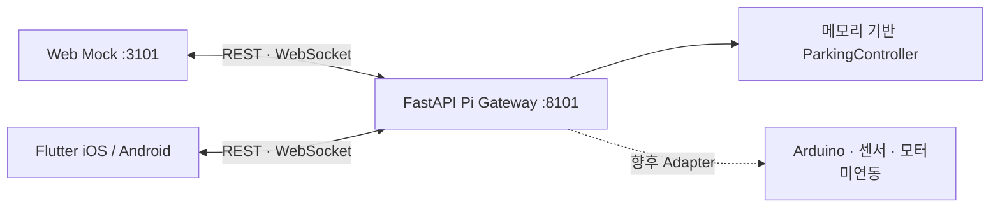

# S.N.A.P

S.N.A.P은 스마트 발렛 주차 시스템의 클라이언트–Raspberry Pi Gateway 통신을 검증하기 위한 공개 프로토타입이다. Web Mock, iOS·Android 공통 Flutter 클라이언트, FastAPI 기반 Pi Simulator를 포함한다.

> 현재 검증 범위는 클라이언트와 메모리 기반 Pi Simulator 사이의 REST·WebSocket 흐름이다. 실제 Arduino, GPIO, 센서, 모터와 물리 안전 제어는 연결하거나 검증하지 않았다.


## 구성

| 구성요소 | 역할 | 기본 주소 |
|---|---|---|
| `web-mock/` | 모바일 우선 주차·출차 Web UI | `http://localhost:3101` |
| `mobile/` | iOS·Android 공통 Flutter 클라이언트 | `PI_API_BASE_URL`로 주입 |
| `pi-bridge/` | FastAPI REST·WebSocket Simulator | `http://localhost:8101` |
| `tools/qemu/` | ARM64 Debian 가상 보드 자동화 | SSH `2222`, Gateway `8101` |



## 빠른 실행

Node.js 22.13 이상과 Python 3.11 이상을 권장한다.

첫 번째 터미널에서 Gateway를 실행한다.

```bash
cd pi-bridge
python3 -m venv .venv
source .venv/bin/activate
python -m pip install -r requirements.txt
python -m app
```

두 번째 터미널에서 Web Mock을 실행한다.

```bash
cd web-mock
npm install
npm run dev
```

브라우저에서 `http://localhost:3101`을 열고 `LIVE PI`를 선택한다. Gateway 없이 화면 흐름만 확인하려면 `SIMULATOR`를 사용한다.

## 검증

```bash
cd pi-bridge
source .venv/bin/activate
python3 -m unittest discover -s tests -v

cd ../web-mock
npm run lint
npm run build
npm run verify:pi
```

Flutter SDK가 준비된 환경에서는 다음을 실행한다.

```bash
cd mobile
sh tool/bootstrap_platforms.sh
flutter pub get
flutter analyze
flutter test
```

상세 사용법은 다음 문서를 참고한다.

- [Web Mock 사용법](web-mock/README.md)
- [Flutter 모바일 클라이언트](mobile/README.md)
- [Raspberry Pi Gateway](pi-bridge/README.md)
- [클라이언트–Gateway 검증](docs/09-client-gateway-verification.md)
- [QEMU ARM64 가상 보드](docs/10-qemu-virtual-board.md)

## 네트워크·보안 경계

이 프로토타입은 인증과 TLS가 없는 개발용 환경이다. 인터넷에 공개하거나 공유기 포트포워딩을 사용하지 말고, 테스트 차량 ID만 사용해 신뢰할 수 있는 사설망에서 실행한다. 실제 하드웨어를 연결하기 전에는 [SECURITY.md](SECURITY.md)의 필수 보강 항목을 적용해야 한다.
