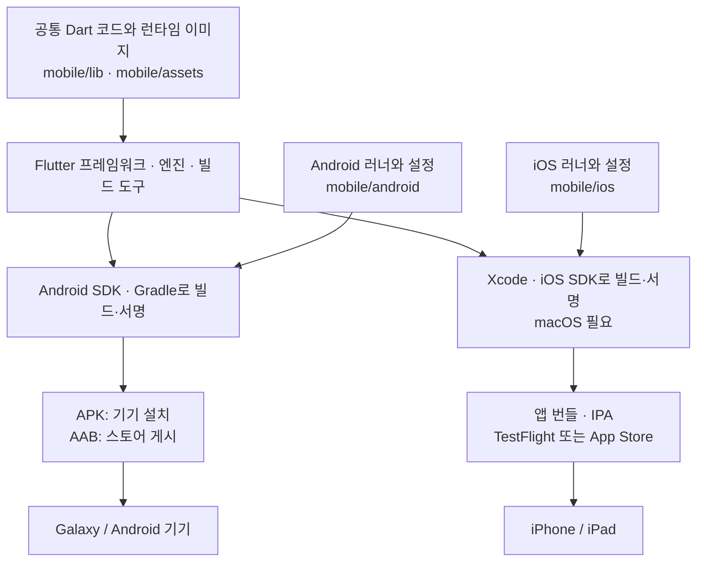
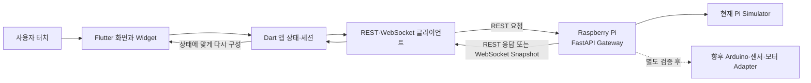

# 처음 배우는 모바일 앱 기술: Flutter·Android·iOS

이 문서는 앱 개발을 한 번도 해보지 않은 S.N.A.P 팀원이 모바일 앱의 기본 구조와 Flutter의 기능·역할을 이해하기 위한 자료다. 설치 명령을 외우는 문서가 아니라, **무엇이 휴대폰에서 실행되고 어떤 도구가 어디에 쓰이는지** 이해하는 것이 목표다.

이 문서를 읽고 나면 다음 질문에 답할 수 있어야 한다.

1. Flutter, Dart, Android, iOS는 각각 무엇인가?
2. 하나의 Flutter 소스가 어떻게 Galaxy 앱과 iPhone 앱이 되는가?
3. Flutter는 어떤 기능을 담당하고 무엇까지 대신하지는 않는가?
4. S.N.A.P 앱에서 버튼을 누르면 Raspberry Pi까지 어떤 일이 일어나는가?
5. 왜 Android와 iPhone을 각각 빌드하고 실제 기기에서 시험해야 하는가?

## 1. 30초 요약

- **Galaxy**는 Samsung이 만드는 휴대폰 제품군이고, 주로 **Android** 운영체제를 사용한다.
- **iPhone**은 Apple이 만드는 휴대폰이고, **iOS** 운영체제를 사용한다.
- **Dart**는 개발자가 앱의 화면과 동작을 작성하는 프로그래밍 언어다.
- **Flutter**는 Dart로 화면을 만들고 여러 플랫폼용 앱을 빌드하도록 도와주는 SDK이자 UI 프레임워크다.
- Android와 iOS는 서로 다른 운영체제이므로, 공통 Flutter 소스를 사용해도 **Android 앱과 iOS 앱을 각각 빌드·서명·설치**한다.
- S.N.A.P에서 Flutter 앱은 휴대폰 화면과 사용자 요청을 담당한다. Raspberry Pi의 Gateway, 센서, 모터를 대신하지 않는다.

> 가장 짧게 말하면: **Dart로 한 번 작성한 앱 코드의 많은 부분을 Flutter가 Android와 iOS에서 함께 쓰게 해주지만, 두 운영체제를 하나로 합치는 것은 아니다.**

## 2. 모바일 앱을 이루는 층

휴대폰 앱은 한 가지 기술만으로 동작하지 않는다. S.N.A.P을 위에서 아래로 나누면 다음과 같다.

| 층 | 쉬운 설명 | S.N.A.P에서의 예 |
|---|---|---|
| 기기 | 손에 들고 사용하는 실제 장치 | Galaxy, iPhone, iPad |
| 운영체제(OS) | 기기와 앱을 관리하는 기본 소프트웨어 | Android, iOS, iPadOS |
| 플랫폼 앱 껍데기 | 운영체제가 앱으로 인식하고 실행하는 시작점 | Android `Activity`, iOS `Runner` |
| Flutter 앱 | 화면, 버튼 동작, 상태 표시를 담당하는 공통 앱 코드 | 홈·차량·기록·설정 화면 |
| 네트워크 | 휴대폰 앱과 외부 서버가 데이터를 주고받는 통로 | Wi-Fi의 REST·WebSocket |
| Gateway | 요청을 받고 주차장 상태를 보내는 서버 | Raspberry Pi의 FastAPI Gateway |
| 장비 | Gateway 뒤에서 연결될 수 있는 실제 장치 | Arduino, 센서, 로봇, 모터 |

여기서 Flutter는 운영체제도 아니고 Raspberry Pi 서버도 아니다. **Android 또는 iOS 위에서 실행되는 앱을 만드는 기술**이다. 이 프로젝트에서는 Flutter 앱이 Raspberry Pi에서 실행되는 것이 아니라 Galaxy나 iPhone에서 실행된다.

Windows PC는 코드 확인과 Android 개발·빌드·설치를 도울 수 있지만, iOS 빌드·서명은 Mac과 Xcode가 있는 담당자가 수행한다. 앱을 설치한 뒤에는 Windows PC가 통신을 중계하는 것이 아니라, **휴대폰 앱이 Wi-Fi를 통해 Raspberry Pi Gateway에 직접 연결**한다.

## 3. Dart와 Flutter는 무엇이 다른가

두 단어는 함께 등장하지만 같은 뜻이 아니다.

| 구분 | Dart | Flutter |
|---|---|---|
| 정체 | 프로그래밍 언어 | 앱 개발 SDK와 UI 프레임워크 |
| 담당 | 변수, 조건문, 함수, 비동기 처리처럼 앱 동작을 표현 | Widget, 화면 배치, 그리기, 터치, 실행 엔진, 테스트·빌드 도구 제공 |
| 관계 | Flutter 앱을 작성하는 언어 | Dart 언어와 런타임을 사용해 앱을 실행·빌드 |
| 단독 사용 | 서버나 명령행 프로그램 등에도 사용 가능 | Flutter 앱은 Dart 코드로 작성 |

**SDK(Software Development Kit)**는 앱 개발에 필요한 라이브러리, 실행 엔진, 컴파일러, 명령행 도구 등을 묶은 개발 도구 세트다. **프레임워크**는 앱의 구조를 만들고 반복 작업을 줄여주는 코드와 규칙의 집합이다. Flutter SDK 안에는 Flutter 프레임워크와 엔진, 개발 도구, Dart SDK가 함께 들어 있다.

Dart가 글을 쓰는 언어라면 Flutter는 그 글을 실제 앱 화면과 동작으로 구성하고 Android·iOS용 결과물로 포장하는 도구 묶음에 가깝다. 이 비유는 역할을 구분하기 위한 것이며, Flutter가 Dart를 Kotlin이나 Swift 문장으로 번역한다는 뜻은 아니다.

[Dart 공식 개요](https://dart.dev/overview)는 Dart가 Flutter 앱의 언어와 런타임을 제공하며, 모바일 배포 시 코드를 기계어로 컴파일할 수 있다고 설명한다.

## 4. Flutter의 기능과 역할

Flutter의 핵심 역할은 **같은 Dart 앱 코드로 여러 플랫폼의 사용자 화면과 공통 동작을 구현할 수 있게 하는 것**이다. S.N.A.P에서는 다음 기능에 쓰인다.

| 기능 | Flutter 또는 Dart 앱 코드의 역할 | S.N.A.P 예 |
|---|---|---|
| 화면 구성 | 작은 Widget을 조합해 화면을 만든다. | 글자, 버튼, 카드, 주차면 목록, 하단 탭 |
| 화면 배치와 그리기 | 크기와 위치를 계산하고 화면의 픽셀을 그린다. | 세로·가로 화면, 휴대폰·태블릿 레이아웃 |
| 디자인 | 색상, 글꼴, 밝은/어두운 테마, 이미지와 애니메이션을 관리한다. | S.N.A.P 블루, Light/Dark, 차량·로봇 이미지 |
| 사용자 입력 | 터치, 스크롤, 텍스트 입력, 탭 전환을 처리한다. | 차량번호 입력, 주차 요청, 설정 탭 이동 |
| 상태에 따른 갱신 | 데이터가 바뀌면 필요한 화면을 다시 계산해 보여준다. | 연결 중 → 연결됨, 빈 주차면 → 사용 중 |
| 앱 생명주기 | 앱이 열리고, 백그라운드로 갔다가 다시 전면으로 돌아오는 상황에 대응한다. | 앱 복귀 시 최신 주차장 상태 재조회 |
| 공통 앱 로직 | Dart 코드로 입력 검사와 업무 흐름을 작성한다. | 차량 선택, 요청 중 중복 버튼 방지 |
| 서버 통신 | Dart 네트워크 코드로 HTTP와 WebSocket을 사용한다. | Pi Snapshot 조회, 실시간 이벤트 수신 |
| 개발 지원 | 실행, Hot Reload, 코드 분석, 테스트, 빌드 명령을 제공한다. | `flutter run`, `flutter analyze`, `flutter test`, `flutter build` |
| 플랫폼 기능 연결 | 플러그인이나 플랫폼 채널로 운영체제 기능을 호출한다. | 향후 카메라·알림·Bluetooth 등이 필요할 때 |

네트워크 요청이나 주차 규칙을 Flutter가 자동으로 만들어 주는 것은 아니다. 개발자가 Dart로 작성한 S.N.A.P 코드가 그 일을 하고, Flutter는 코드가 화면·앱 생명주기와 연결되어 Android와 iOS에서 실행될 기반을 제공한다. 현재 S.N.A.P 네트워크 계층은 외부 HTTP 패키지가 아니라 Dart SDK의 `dart:io`를 사용한다.

### 4.1 Widget이란 무엇인가

Widget은 Flutter 화면을 만드는 기본 블록이다. 화면에 보이는 글자와 버튼뿐 아니라 다음 항목도 Widget으로 조합한다.

- 가로·세로 배치
- 여백과 정렬
- 스크롤 영역
- 화면의 안전 영역
- 탭 메뉴와 화면 전환
- 테마와 애니메이션

Widget은 레고 블록 하나보다는 **화면의 한 부분을 어떻게 구성할지 적은 설명서**에 가깝다. 작은 Widget을 중첩해 한 화면을 만들고, 여러 화면을 묶어 앱을 만든다.

Flutter는 일반적으로 Dart Widget을 Android 버튼이나 iOS 버튼으로 하나씩 변환하지 않는다. Flutter 프레임워크와 엔진이 Widget 구조를 배치하고 그린다. 덕분에 두 운영체제에서 일관된 디자인을 만들기 쉽지만, 필요한 경우 네이티브 화면 요소나 운영체제 기능도 연결할 수 있다. 자세한 구조는 [Flutter 공식 아키텍처 개요](https://docs.flutter.dev/resources/architectural-overview)를 참고한다.

### 4.2 상태가 바뀌면 화면이 바뀌는 방식

**상태(state)**는 지금 앱이 알고 있는 값이다. 예를 들어 다음 값들이 상태다.

- Gateway가 연결됐는가?
- 빈 주차면은 몇 개인가?
- 선택된 차량은 무엇인가?
- 로봇 작업은 몇 퍼센트 진행됐는가?

Flutter 화면은 `현재 상태 → 지금 보여줄 화면`이라는 관계로 작성한다. WebSocket으로 새 Snapshot이 들어와 상태가 바뀌면 Flutter는 새 상태에 맞는 Widget 구조를 계산하고 필요한 화면 부분을 갱신한다. 개발자가 글자 하나하나를 직접 찾아 바꾸는 방식과 다르다.

## 5. 하나의 소스가 Android·iOS 앱이 되는 과정

“한 코드베이스”는 같은 파일 한 개를 Galaxy와 iPhone이 그대로 실행한다는 뜻이 아니다. 공통 Dart 코드에서 시작해 플랫폼별 도구와 설정을 합쳐 **서로 다른 앱 결과물**을 만든다는 뜻이다.



빌드된 앱에는 공통 Dart 코드의 컴파일 결과, Flutter 실행에 필요한 엔진 부분, 이미지 같은 리소스, 플랫폼별 앱 시작점과 설정이 함께 들어간다. Android와 iOS의 운영체제 규칙이 다르기 때문에 패키징과 서명 과정도 다르다.

Flutter가 하는 일은 Dart 소스를 Kotlin과 Swift 소스로 줄마다 번역하는 것이 아니다. 모바일 Release 빌드에서는 Dart 앱 코드를 기기 CPU가 실행할 수 있는 기계어로 미리 컴파일하고, 플랫폼별 Flutter 실행 환경과 함께 각 운영체제의 앱 형식으로 포장한다.

### 5.1 운영체제와 개발 도구를 구분하기

| 이름 | 종류 | 이 프로젝트에서 하는 일 |
|---|---|---|
| Android | 휴대폰 운영체제 | Galaxy에서 Android용 S.N.A.P 앱을 실행한다. |
| Android Studio | 개발 프로그램(IDE) | Android SDK 관리, 코드 확인, 기기 연결 등을 돕는다. |
| Android SDK·Gradle | 빌드 도구 | Flutter의 공통 코드와 Android 설정을 APK·AAB로 만든다. |
| iOS·iPadOS | 휴대폰·태블릿 운영체제 | iPhone·iPad에서 iOS용 S.N.A.P 앱을 실행한다. |
| Xcode·iOS SDK | Apple 개발·빌드 도구 | Mac에서 iOS 앱을 빌드·서명하고 실제 기기에 설치한다. |
| Flutter CLI | 공통 개발 명령 도구 | 플랫폼별 빌드 도구를 연결해 실행·분석·테스트·빌드를 요청한다. |

Android Studio가 Android 그 자체가 아니듯 Xcode도 iOS 그 자체가 아니다. Flutter는 이 도구들과 협력하며, 플랫폼 SDK 없이 Android·iOS 설치 파일을 단독으로 만들어 내는 도구는 아니다.

## 6. 공통으로 쓰는 부분과 플랫폼별 부분

| 주로 공통 Dart 코드로 작성 | Android·iOS별로 확인하거나 설정 |
|---|---|
| 화면 구조와 디자인 | 앱 이름, 아이콘, 시작 화면 |
| 버튼을 눌렀을 때의 공통 동작 | 앱 식별자와 최소 OS 버전 |
| 차량·주차면·로봇 데이터 모델 | 인터넷·로컬 네트워크 등 권한 |
| REST·WebSocket 통신 흐름 | 평문 HTTP 같은 네트워크 보안 정책 |
| 연결·로딩·오류 상태 처리 | Android 뒤로가기와 iOS 제스처 등 사용 방식 |
| 입력 검사와 공통 업무 규칙 | 서명 인증서, 프로비저닝, 스토어 등록 |
| Light/Dark 테마 | 플랫폼별 플러그인 구현과 지원 범위 |

따라서 Flutter를 쓴다고 해서 플랫폼별 작업이 사라지는 것은 아니다. 공통 코드의 양을 크게 늘리고 중복을 줄여주는 것이지, Android와 iOS의 규칙까지 같게 만드는 것은 아니다.

Android에서 정상 동작한 기능도 iPhone에서 다시 확인해야 한다. 화면 크기, 권한 창, 네트워크 정책, 키보드와 제스처, 운영체제 버전이 다르기 때문이다.

## 7. Android 앱과 Flutter의 관계

Android는 Google이 개발하는 모바일 운영체제다. Flutter 앱도 Android가 실행하는 일반 앱 패키지 안에 들어간다.

- `mobile/android/`에는 Android가 앱을 시작하기 위한 Runner, Manifest, Gradle 설정과 아이콘 등이 있다.
- Android의 `MainActivity`가 Flutter 실행 환경을 열고 공통 Dart 앱을 시작한다.
- Flutter 빌드 도구는 Android SDK와 Gradle을 이용해 Android 결과물을 만든다.
- 앱은 Android의 권한, 버전 호환성, 서명과 배포 규칙을 따라야 한다.

Android에서 자주 보는 결과물은 두 가지다.

| 형식 | 용도 | 휴대폰에 바로 설치 |
|---|---|---|
| APK | Android에서 실행 가능한 설치 파일 | 가능 |
| AAB | Google Play 등이 기기별 APK를 만들기 위한 게시 파일 | 불가능 |

AAB를 APK처럼 눌러 설치할 수는 없다. Android 공식 문서도 [APK는 설치 형식, AAB는 게시 형식](https://developer.android.com/guide/app-bundle/faq)으로 구분한다.

Windows 팀원은 Flutter와 Android SDK가 준비되면 Android 앱을 빌드할 수 있다. 이미 만들어진 APK를 확인만 하는 팀원은 Flutter나 Android Studio를 설치할 필요가 없다.

## 8. iOS 앱과 Flutter의 관계

iOS는 iPhone에서 실행되는 Apple의 모바일 운영체제다. iPad에서는 iPadOS를 사용하지만 이 프로젝트의 같은 iOS 계열 Runner를 사용한다.

- `mobile/ios/`에는 iOS Runner, Xcode 프로젝트, `Info.plist`, 시작 화면 등이 있다.
- iOS Runner가 Flutter 엔진과 공통 Dart 앱을 시작한다.
- 앱은 iOS의 로컬 네트워크 권한, ATS 네트워크 정책, 서명과 배포 규칙을 따라야 한다.
- iOS 앱 빌드와 서명에는 Xcode가 필요하므로 Flutter의 공식 iOS 개발환경은 macOS에서 구성한다.

`flutter build ipa`는 Xcode archive와 IPA를 만든다. 하지만 IPA 파일이 있다고 해서 아무 iPhone에 자유롭게 설치할 수 있는 것은 아니다. Apple의 인증서, 프로비저닝과 허용된 배포 방식이 필요하다.

일반 팀원이 시험할 때는 보통 TestFlight 초대를 사용한다. TestFlight는 개발자가 App Store Connect에 올린 베타 빌드를 테스터가 iPhone에 설치하고 의견을 보낼 수 있게 하는 Apple의 배포 방식이다.

Windows PC만 사용하는 팀원은 iOS 빌드를 만들지 않는다. Mac 담당자가 빌드·서명·TestFlight 업로드를 하고, Windows 팀원은 iPhone에서 초대를 열어 설치한다. 자세한 빌드 흐름은 [Flutter 공식 iOS 배포 문서](https://docs.flutter.dev/deployment/ios)를 참고한다.

## 9. 휴대폰에서 주차 버튼을 누르면 생기는 일

Flutter 화면은 혼자 주차를 처리하지 않는다. S.N.A.P에서는 다음 순서로 여러 구성요소가 협력한다.



예를 들어 주차 요청은 다음처럼 흐른다.

1. 사용자가 Flutter 버튼을 누른다.
2. 앱이 선택한 차량과 예상 시간을 검사한다.
3. Dart 네트워크 코드가 Raspberry Pi Gateway에 REST 요청을 보낸다.
4. Gateway가 요청을 처리하고 REST 응답에 최신 Snapshot을 담아 보낸다.
5. 이후 상태 변화도 Gateway가 WebSocket Snapshot으로 보낸다.
6. 앱 상태가 갱신되고 Flutter가 진행 화면과 주차면을 다시 그린다.

앱은 Arduino, 센서, 모터에 직접 명령하지 않는다. Flutter 화면이 연결되고 움직인다고 해서 실제 장비까지 검증됐다는 뜻도 아니다. 실제 장비 제어와 안전 판단은 Raspberry Pi 뒤쪽의 별도 영역이다.

## 10. S.N.A.P `mobile/` 폴더 지도

처음에는 모든 파일을 이해할 필요가 없다. 변경 목적에 따라 어느 폴더를 보는지만 알면 된다.

| 경로 | 역할 | 언제 보는가 |
|---|---|---|
| [`mobile/lib/main.dart`](../mobile/lib/main.dart) | Flutter 앱의 Dart 시작점 | 앱이 어디서 시작하는지 볼 때 |
| [`mobile/lib/app/`](../mobile/lib/app/) | 앱 설정, 전체 테마, 최상위 앱 Widget | Gateway 설정이나 공통 디자인을 바꿀 때 |
| [`mobile/lib/core/contracts/`](../mobile/lib/core/contracts/) | Pi와 주고받는 데이터 모델과 상태 값 | API 데이터 형식을 바꿀 때 |
| [`mobile/lib/core/networking/`](../mobile/lib/core/networking/) | REST, WebSocket, 재연결, 동기화 | 통신 동작을 바꿀 때 |
| [`mobile/lib/features/parking_lot/`](../mobile/lib/features/parking_lot/) | 홈·차량·기록·설정과 주차 흐름 | 사용자 기능과 화면을 바꿀 때 |
| [`mobile/assets/images/`](../mobile/assets/images/) | 앱 실행 중 실제로 사용하는 이미지 | 차량·로봇 이미지를 바꿀 때 |
| [`mobile/assets/storyboard/tesla-theme/`](../mobile/assets/storyboard/tesla-theme/) | 화면을 설계할 때 참고한 기준 이미지 | 디자인 의도를 확인할 때 |
| [`mobile/android/`](../mobile/android/) | Android Runner, 권한, Gradle, 아이콘 | Galaxy 빌드·권한·서명을 바꿀 때 |
| [`mobile/ios/`](../mobile/ios/) | iOS Runner, Xcode, 권한, 서명 설정 | iPhone 빌드·권한·배포를 바꿀 때 |
| [`mobile/test/`](../mobile/test/) | 화면·상태·통신의 자동 테스트 | 변경 전후 기능이 유지되는지 볼 때 |
| [`mobile/pubspec.yaml`](../mobile/pubspec.yaml) | 앱 이름·버전, Dart/Flutter 의존성, 런타임 이미지 목록 | 패키지나 이미지를 추가할 때 |

스토리보드의 완성 화면 전체를 앱 배경으로 붙인 것은 아니다. `tesla-theme`는 디자인 기준 자료이고, 실행 중에는 `assets/images`의 분리된 이미지와 Flutter Widget이 실제 Gateway 데이터에 맞춰 화면을 구성한다.

현재 Android `MainActivity`와 iOS `AppDelegate`에는 Flutter를 시작하는 최소 코드만 있다. 주차 앱의 주요 기능은 대부분 `mobile/lib/`의 공통 Dart 코드에 있다.

## 11. 개발, 빌드, 설치, 실행은 서로 다르다

| 단계 | 뜻 | 결과 |
|---|---|---|
| 개발 | Dart와 플랫폼 설정 파일을 수정한다. | 소스 코드가 바뀐다. |
| 분석·테스트 | 오류 가능성과 예상 동작을 자동으로 확인한다. | 보고서와 성공·실패 결과가 나온다. |
| 빌드 | 소스와 리소스를 기기에서 실행할 앱으로 컴파일·포장한다. | APK, AAB, app bundle, IPA 등이 나온다. |
| 서명 | 누가 만든 앱인지 확인할 수 있도록 플랫폼 인증 정보를 붙인다. | 설치·배포 가능한 신뢰 관계가 생긴다. |
| 설치 | 완성된 앱 패키지를 휴대폰에 넣는다. | 홈 화면에서 앱을 열 수 있다. |
| 실행 | 설치된 앱이 운영체제 위에서 동작한다. | 화면 표시와 Pi 통신이 시작된다. |

소스 코드를 GitHub에서 내려받기만 해서는 휴대폰 앱이 설치되지 않는다. 먼저 플랫폼별 빌드와 필요한 서명을 거쳐야 한다.

### 11.1 Debug, Profile, Release

| 모드 | 목적 | 특징 |
|---|---|---|
| Debug | 기능 개발과 문제 찾기 | 디버거와 Hot Reload 사용, 최종 속도·용량 평가에는 부적합 |
| Profile | 실제 기기 성능 측정 | 성능 추적 기능을 남기고 Release와 비슷하게 실행 |
| Release | 사용자 배포 | 디버깅 기능을 빼고 시작 속도·실행 속도·크기를 최적화 |

**Hot Reload**는 Debug 앱을 실행한 상태에서 변경된 Dart 코드를 빠르게 반영하는 개발 기능이다. 개발자가 화면을 빠르게 고치는 데 도움이 되지만, 이미 팀원에게 설치된 앱이나 스토어 앱이 저절로 업데이트되는 기능은 아니다. 일부 변경은 Hot Restart나 앱 완전 재실행이 필요하다.

[Flutter 공식 빌드 모드 문서](https://docs.flutter.dev/testing/build-modes)는 Hot Reload를 Debug 모드에서 사용하고, 성능은 실제 기기의 Profile 또는 Release 조건에서 판단하도록 구분한다.

## 12. 플러그인과 플랫폼 채널

카메라, 위치, Bluetooth, 푸시 알림처럼 운영체제가 관리하는 기능은 Flutter 공통 코드만으로 끝나지 않을 수 있다. 보통은 **플러그인**을 사용한다.

```text
Dart 앱 코드
  → 플러그인의 공통 API
  → Android의 Kotlin/Java 구현 또는 iOS의 Swift/Objective-C 구현
  → 운영체제와 휴대폰 기능
```

적절한 플러그인이 없으면 **플랫폼 채널**로 Dart와 Android·iOS 네이티브 코드를 직접 연결할 수 있다. 플러그인을 추가할 때는 다음을 확인해야 한다.

- Android와 iOS를 모두 지원하는가?
- 각 플랫폼의 최소 OS 버전은 무엇인가?
- Manifest나 `Info.plist`에 어떤 권한 설명이 필요한가?
- 실제 Galaxy와 iPhone에서 모두 시험했는가?
- 패키지가 유지보수되고 있으며 라이선스와 보안이 적절한가?

현재 `pubspec.yaml`에는 Flutter SDK와 테스트 SDK 외에 직접 추가한 외부 Dart 패키지가 없다. 향후 기기 기능을 추가하면 이 구조가 달라질 수 있다. Flutter의 플랫폼 연결 방식은 [공식 플랫폼 채널 문서](https://docs.flutter.dev/platform-integration/platform-channels)에서 확인할 수 있다.

## 13. Flutter가 대신하지 않는 것

| Flutter가 도와주는 것 | Flutter가 자동으로 해결하지 않는 것 |
|---|---|
| 공통 화면과 앱 동작 작성 | Raspberry Pi 서버 실행과 운영 |
| Android·iOS용 앱 빌드 흐름 제공 | 실제 센서·모터 제어와 물리 안전 보장 |
| Widget과 상태 기반 화면 갱신 | 사용자 인증, 권한 검사, 데이터베이스 설계 |
| REST·WebSocket을 사용할 앱 기반 제공 | API 주소와 데이터 계약을 스스로 결정 |
| 플러그인으로 플랫폼 기능 연결 | 모든 플러그인의 품질·보안·양쪽 플랫폼 지원 보장 |
| 테스트 도구 제공 | Android와 iPhone 실기기 시험을 대신 수행 |
| 개발용 Hot Reload 제공 | 배포 앱의 자동 업데이트와 스토어 심사 처리 |

Flutter를 선택했다고 해서 백엔드, 보안, 서명, 스토어 운영, 실제 장비 검증이 필요 없어지는 것은 아니다.

## 14. S.N.A.P 프로젝트에만 해당하는 현재 조건

일반적인 Flutter 설명과 현재 프로젝트 상태를 구분해야 한다.

- Flutter 자체는 여러 플랫폼을 지원하지만 현재 S.N.A.P `mobile/`의 제품·검증 대상은 Android와 iOS다.
- 현재 네트워크 코드는 브라우저에서 사용할 수 없는 `dart:io`를 사용하므로 Flutter Web로 옮기려면 네트워크 어댑터를 분리해야 한다. 별도의 `web-mock/`은 Flutter 모바일 앱과 다른 프로그램이다.
- Gateway 주소, 주차장 ID, 고객 ID는 현재 앱을 빌드할 때 주입한다. 앱의 설정 화면에서는 Endpoint를 확인할 수 있지만 수정할 수 없다.
- 문서에서 `PI_IP`는 Windows PC나 휴대폰 주소가 아니라 **그 팀이 사용하는 Raspberry Pi의 IP 주소**다. 휴대폰에서 `127.0.0.1`을 사용하면 Pi가 아니라 휴대폰 자신을 가리킨다.
- 팀원마다 Raspberry Pi 주소가 다르면 각 팀원의 `PI_IP`에 맞춰 앱을 다시 실행하거나 새 배포본을 빌드해야 한다. 빌드 시 주입되는 값이므로 Hot Reload만으로 바뀌지 않는다.
- Android와 iOS의 로컬 HTTP 허용 방식이 다르다. 현재 Android Debug 설정은 특정 Pi IP를 고정하지 않지만, iOS 내부 시험 빌드는 Dart의 Gateway 주소와 `Info.plist`의 ATS 예외 주소가 같은 `PI_IP`인지 모두 확인해야 한다. 이는 Flutter 전체의 규칙이 아니라 현재 S.N.A.P 프로젝트 설정이며, 신뢰할 수 있는 내부 시험망에만 사용한다.
- 현재 Pi의 Simulator 모드는 실제 Pi 보드에서 앱 통신을 확인하지만 Arduino·센서·모터의 실제 동작을 증명하지 않는다.
- Tesla 테마의 화면 구조는 Android와 iOS에서 공유하지만 두 플랫폼의 화면 크기와 OS 동작은 각각 시험한다.

## 15. 팀에서 역할을 나누는 방법

| 역할 | 주로 담당하는 것 | 꼭 함께 확인할 사람 |
|---|---|---|
| Flutter 기능·UI 담당 | `mobile/lib/`, 화면, 상태, 통신, 공통 테스트 | Android·iOS 실기기 테스터 |
| Android 배포 담당 | `mobile/android/`, Gradle, 서명, APK/AAB | Galaxy 테스터 |
| iOS 배포 담당 | `mobile/ios/`, Mac·Xcode, 서명, TestFlight | iPhone 테스터 |
| Pi Gateway 담당 | `pi-bridge/`, Gateway 실행, 네트워크, 로그 | 모바일 통신 담당 |
| 장비 담당 | Arduino·센서·모터와 물리 안전 | Pi Gateway 담당 |
| 기능 확인 담당 | 정해진 시나리오 실행, 화면·오류·시간 기록 | 해당 기능 개발자 |

공통 Flutter 코드를 바꾸면 Android와 iOS 양쪽에 영향을 줄 수 있다. 한 플랫폼의 Manifest나 `Info.plist`만 바꾸면 반대 플랫폼에는 적용되지 않는다. API 계약을 바꾸면 Flutter 앱과 Pi Gateway가 같은 데이터 형식을 사용하도록 함께 조정해야 한다.

## 16. 자주 하는 오해

| 오해 | 정확한 설명 |
|---|---|
| Flutter는 프로그래밍 언어다. | 언어는 Dart이고, Flutter는 SDK와 UI 프레임워크다. |
| Flutter가 Android와 iOS를 하나로 합친다. | 서로 다른 두 플랫폼 앱이 공통 Dart 코드를 많이 공유하게 한다. |
| Flutter가 Dart를 Kotlin과 Swift로 변환한다. | Dart 코드를 컴파일하고 Flutter 엔진·플랫폼 Runner와 함께 앱으로 패키징한다. |
| Android용 APK를 iPhone에도 설치할 수 있다. | APK는 Android 전용이다. iPhone은 서명된 iOS 빌드와 Apple 배포 절차가 필요하다. |
| Android에서 되면 iPhone에서도 반드시 된다. | 권한, 서명, 네트워크 정책, 화면 동작이 달라 양쪽 시험이 필요하다. |
| Hot Reload를 하면 팀원 앱도 업데이트된다. | Hot Reload는 개발 중 연결된 Debug 앱에만 적용된다. |
| Flutter는 QEMU나 휴대폰 에뮬레이터다. | Flutter는 앱을 만드는 SDK다. 개발 중 가상 기기에서도 실행할 수 있지만 실제 Galaxy·iPhone에서도 실행하며, S.N.A.P의 최종 확인은 실제 휴대폰과 Raspberry Pi에서 한다. |
| 앱 화면이 움직이면 실제 로봇도 검증됐다. | 화면·Gateway·Simulator 검증과 실제 장비 검증은 별개다. |

## 17. 핵심 용어 사전

| 용어 | 뜻 |
|---|---|
| OS | 휴대폰과 앱을 관리하는 운영체제. Android와 iOS가 대표적이다. |
| 소스 코드 | 개발자가 작성한 원본 프로그램 파일이다. 그 자체가 설치 앱은 아니다. |
| Dart | Flutter 앱 코드를 작성하는 프로그래밍 언어다. |
| Flutter | Dart로 여러 플랫폼 앱을 만들기 위한 SDK·UI 프레임워크다. |
| Widget | Flutter 화면과 동작을 조합하는 기본 구성 단위다. |
| State | 현재 연결 상태나 선택 차량처럼 화면이 참고하는 현재 값이다. |
| Runner | 운영체제가 Flutter 엔진과 Dart 앱을 시작하도록 연결하는 플랫폼별 앱 껍데기다. |
| Build | 소스와 리소스를 실행 가능한 앱 결과물로 만드는 과정이다. |
| Signing | 앱 제작자를 확인할 수 있도록 디지털 서명을 붙이는 과정이다. |
| APK | Android 휴대폰에 설치할 수 있는 앱 파일이다. |
| AAB | 스토어가 Android 기기별 APK를 만들기 위한 게시 파일이다. |
| IPA | 서명·배포 조건이 적용되는 iOS 앱 패키지 형식이다. |
| TestFlight | Apple 플랫폼의 베타 앱 배포·피드백 서비스다. |
| API | 서로 다른 프로그램이 정해진 형식으로 요청과 응답을 주고받는 약속이다. |
| REST | 필요할 때 HTTP 요청을 보내 데이터를 조회하거나 변경하는 통신 방식이다. |
| WebSocket | 연결을 유지하며 서버의 새 상태를 실시간에 가깝게 받는 통신 방식이다. |
| Gateway | 모바일 앱 요청과 주차장 상태를 중간에서 처리하는 Raspberry Pi 서버다. |

## 18. 이해 확인

아래 문장을 스스로 설명할 수 있으면 핵심을 이해한 것이다.

1. Flutter는 운영체제가 아니라 Dart 기반 앱 개발 도구다.
2. 한 Flutter 코드베이스에서도 Android와 iOS 앱은 각각 빌드·서명한다.
3. APK는 iPhone에 설치할 수 없고 AAB도 Galaxy에 직접 설치하는 파일이 아니다.
4. S.N.A.P Flutter 앱은 Raspberry Pi Gateway와 통신하지만 센서와 모터를 직접 제어하지 않는다.
5. 공통 코드를 수정하면 양쪽 플랫폼을 확인하고, 플랫폼 설정을 수정하면 해당 플랫폼을 별도로 확인한다.

## 19. 다음에 볼 문서

- 앱을 설치해서 화면을 확인하는 팀원: [Windows 팀원용 Galaxy·iPhone 실기기 확인](manual/windows-mobile-app-device-check.md)
- 모바일 코드와 실행 명령을 보는 개발자: [S.N.A.P Flutter 모바일 클라이언트](../mobile/README.md)
- Flutter 개발환경과 Pi 연동을 직접 구성하는 담당자: [Flutter 고객 앱과 실제 Raspberry Pi Wi-Fi 연동 매뉴얼](manual/raspberry-pi-flutter-app-wifi.md)

## 공식 참고 자료

- [Dart 개요](https://dart.dev/overview)
- [Flutter 아키텍처 개요](https://docs.flutter.dev/resources/architectural-overview)
- [Flutter 플랫폼 통합](https://docs.flutter.dev/platform-integration)
- [Flutter 빌드 모드](https://docs.flutter.dev/testing/build-modes)
- [Flutter 플랫폼 채널](https://docs.flutter.dev/platform-integration/platform-channels)
- [Flutter Android 빌드·배포](https://docs.flutter.dev/deployment/android)
- [Android APK·AAB 기본 구조](https://developer.android.com/guide/components/fundamentals)
- [Flutter iOS 개발환경](https://docs.flutter.dev/platform-integration/ios/setup)
- [Flutter iOS 빌드·배포](https://docs.flutter.dev/deployment/ios)
- [Apple ATS 로컬 네트워크 설정](https://developer.apple.com/documentation/bundleresources/information-property-list/nsapptransportsecurity/nsallowslocalnetworking)
- [Apple TestFlight 개요](https://developer.apple.com/help/app-store-connect/test-a-beta-version/testflight-overview)
